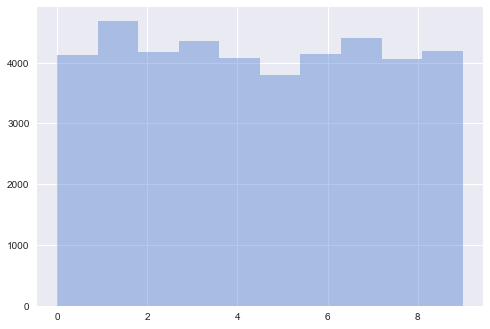

```python
import numpy as np
import pandas as pd

import math

from keras.models import Sequential
from keras.layers.core import Dense, Dropout, Lambda, Flatten, Reshape
from keras.layers.convolutional import Conv2D, ZeroPadding2D
from keras.layers.pooling import MaxPooling2D
from keras.layers.normalization import BatchNormalization
from keras.regularizers import l2
from keras.preprocessing.image import ImageDataGenerator
from keras.utils.np_utils import to_categorical

from sklearn.model_selection import train_test_split
from sklearn.utils import shuffle

import matplotlib
import seaborn as sns

%matplotlib inline
sns.set(color_codes=True, palette='muted')
```

## Glimpse at the MNIST Data


```python
TRAIN_FILE = 'train.csv'
TEST_FILE = 'test.csv'

df_train = pd.read_csv(TRAIN_FILE)
df_test = pd.read_csv(TEST_FILE)
```

### Getting an Overview


```python
print('Training data:', df_train.info())
print('\n --- \n')
print('Test data:', df_test.info())
```

    <class 'pandas.core.frame.DataFrame'>
    RangeIndex: 42000 entries, 0 to 41999
    Columns: 785 entries, label to pixel783
    dtypes: int64(785)
    memory usage: 251.5 MB
    Training data: None
    
     --- 
    
    <class 'pandas.core.frame.DataFrame'>
    RangeIndex: 28000 entries, 0 to 27999
    Columns: 784 entries, pixel0 to pixel783
    dtypes: int64(784)
    memory usage: 167.5 MB
    Test data: None


```python
df_train.describe()
```


<div>
<table border="1" class="dataframe">
  <thead>
    <tr style="text-align: right;">
      <th></th>
      <th>label</th>
      <th>pixel0</th>
      <th>pixel1</th>
      <th>pixel2</th>
      <th>pixel3</th>
      <th>pixel4</th>
      <th>pixel5</th>
      <th>pixel6</th>
      <th>pixel7</th>
      <th>pixel8</th>
      <th>...</th>
      <th>pixel774</th>
      <th>pixel775</th>
      <th>pixel776</th>
      <th>pixel777</th>
      <th>pixel778</th>
      <th>pixel779</th>
      <th>pixel780</th>
      <th>pixel781</th>
      <th>pixel782</th>
      <th>pixel783</th>
    </tr>
  </thead>
  <tbody>
    <tr>
      <th>count</th>
      <td>42000.000000</td>
      <td>42000.0</td>
      <td>42000.0</td>
      <td>42000.0</td>
      <td>42000.0</td>
      <td>42000.0</td>
      <td>42000.0</td>
      <td>42000.0</td>
      <td>42000.0</td>
      <td>42000.0</td>
      <td>...</td>
      <td>42000.000000</td>
      <td>42000.000000</td>
      <td>42000.000000</td>
      <td>42000.00000</td>
      <td>42000.000000</td>
      <td>42000.000000</td>
      <td>42000.0</td>
      <td>42000.0</td>
      <td>42000.0</td>
      <td>42000.0</td>
    </tr>
    <tr>
      <th>mean</th>
      <td>4.456643</td>
      <td>0.0</td>
      <td>0.0</td>
      <td>0.0</td>
      <td>0.0</td>
      <td>0.0</td>
      <td>0.0</td>
      <td>0.0</td>
      <td>0.0</td>
      <td>0.0</td>
      <td>...</td>
      <td>0.219286</td>
      <td>0.117095</td>
      <td>0.059024</td>
      <td>0.02019</td>
      <td>0.017238</td>
      <td>0.002857</td>
      <td>0.0</td>
      <td>0.0</td>
      <td>0.0</td>
      <td>0.0</td>
    </tr>
    <tr>
      <th>std</th>
      <td>2.887730</td>
      <td>0.0</td>
      <td>0.0</td>
      <td>0.0</td>
      <td>0.0</td>
      <td>0.0</td>
      <td>0.0</td>
      <td>0.0</td>
      <td>0.0</td>
      <td>0.0</td>
      <td>...</td>
      <td>6.312890</td>
      <td>4.633819</td>
      <td>3.274488</td>
      <td>1.75987</td>
      <td>1.894498</td>
      <td>0.414264</td>
      <td>0.0</td>
      <td>0.0</td>
      <td>0.0</td>
      <td>0.0</td>
    </tr>
    <tr>
      <th>min</th>
      <td>0.000000</td>
      <td>0.0</td>
      <td>0.0</td>
      <td>0.0</td>
      <td>0.0</td>
      <td>0.0</td>
      <td>0.0</td>
      <td>0.0</td>
      <td>0.0</td>
      <td>0.0</td>
      <td>...</td>
      <td>0.000000</td>
      <td>0.000000</td>
      <td>0.000000</td>
      <td>0.00000</td>
      <td>0.000000</td>
      <td>0.000000</td>
      <td>0.0</td>
      <td>0.0</td>
      <td>0.0</td>
      <td>0.0</td>
    </tr>
    <tr>
      <th>25%</th>
      <td>2.000000</td>
      <td>0.0</td>
      <td>0.0</td>
      <td>0.0</td>
      <td>0.0</td>
      <td>0.0</td>
      <td>0.0</td>
      <td>0.0</td>
      <td>0.0</td>
      <td>0.0</td>
      <td>...</td>
      <td>0.000000</td>
      <td>0.000000</td>
      <td>0.000000</td>
      <td>0.00000</td>
      <td>0.000000</td>
      <td>0.000000</td>
      <td>0.0</td>
      <td>0.0</td>
      <td>0.0</td>
      <td>0.0</td>
    </tr>
    <tr>
      <th>50%</th>
      <td>4.000000</td>
      <td>0.0</td>
      <td>0.0</td>
      <td>0.0</td>
      <td>0.0</td>
      <td>0.0</td>
      <td>0.0</td>
      <td>0.0</td>
      <td>0.0</td>
      <td>0.0</td>
      <td>...</td>
      <td>0.000000</td>
      <td>0.000000</td>
      <td>0.000000</td>
      <td>0.00000</td>
      <td>0.000000</td>
      <td>0.000000</td>
      <td>0.0</td>
      <td>0.0</td>
      <td>0.0</td>
      <td>0.0</td>
    </tr>
    <tr>
      <th>75%</th>
      <td>7.000000</td>
      <td>0.0</td>
      <td>0.0</td>
      <td>0.0</td>
      <td>0.0</td>
      <td>0.0</td>
      <td>0.0</td>
      <td>0.0</td>
      <td>0.0</td>
      <td>0.0</td>
      <td>...</td>
      <td>0.000000</td>
      <td>0.000000</td>
      <td>0.000000</td>
      <td>0.00000</td>
      <td>0.000000</td>
      <td>0.000000</td>
      <td>0.0</td>
      <td>0.0</td>
      <td>0.0</td>
      <td>0.0</td>
    </tr>
    <tr>
      <th>max</th>
      <td>9.000000</td>
      <td>0.0</td>
      <td>0.0</td>
      <td>0.0</td>
      <td>0.0</td>
      <td>0.0</td>
      <td>0.0</td>
      <td>0.0</td>
      <td>0.0</td>
      <td>0.0</td>
      <td>...</td>
      <td>254.000000</td>
      <td>254.000000</td>
      <td>253.000000</td>
      <td>253.00000</td>
      <td>254.000000</td>
      <td>62.000000</td>
      <td>0.0</td>
      <td>0.0</td>
      <td>0.0</td>
      <td>0.0</td>
    </tr>
  </tbody>
</table>
<p>8 rows × 785 columns</p>
</div>


```python
df_test.describe()
```


<div>
<table border="1" class="dataframe">
  <thead>
    <tr style="text-align: right;">
      <th></th>
      <th>pixel0</th>
      <th>pixel1</th>
      <th>pixel2</th>
      <th>pixel3</th>
      <th>pixel4</th>
      <th>pixel5</th>
      <th>pixel6</th>
      <th>pixel7</th>
      <th>pixel8</th>
      <th>pixel9</th>
      <th>...</th>
      <th>pixel774</th>
      <th>pixel775</th>
      <th>pixel776</th>
      <th>pixel777</th>
      <th>pixel778</th>
      <th>pixel779</th>
      <th>pixel780</th>
      <th>pixel781</th>
      <th>pixel782</th>
      <th>pixel783</th>
    </tr>
  </thead>
  <tbody>
    <tr>
      <th>count</th>
      <td>28000.0</td>
      <td>28000.0</td>
      <td>28000.0</td>
      <td>28000.0</td>
      <td>28000.0</td>
      <td>28000.0</td>
      <td>28000.0</td>
      <td>28000.0</td>
      <td>28000.0</td>
      <td>28000.0</td>
      <td>...</td>
      <td>28000.000000</td>
      <td>28000.000000</td>
      <td>28000.000000</td>
      <td>28000.000000</td>
      <td>28000.000000</td>
      <td>28000.0</td>
      <td>28000.0</td>
      <td>28000.0</td>
      <td>28000.0</td>
      <td>28000.0</td>
    </tr>
    <tr>
      <th>mean</th>
      <td>0.0</td>
      <td>0.0</td>
      <td>0.0</td>
      <td>0.0</td>
      <td>0.0</td>
      <td>0.0</td>
      <td>0.0</td>
      <td>0.0</td>
      <td>0.0</td>
      <td>0.0</td>
      <td>...</td>
      <td>0.164607</td>
      <td>0.073214</td>
      <td>0.028036</td>
      <td>0.011250</td>
      <td>0.006536</td>
      <td>0.0</td>
      <td>0.0</td>
      <td>0.0</td>
      <td>0.0</td>
      <td>0.0</td>
    </tr>
    <tr>
      <th>std</th>
      <td>0.0</td>
      <td>0.0</td>
      <td>0.0</td>
      <td>0.0</td>
      <td>0.0</td>
      <td>0.0</td>
      <td>0.0</td>
      <td>0.0</td>
      <td>0.0</td>
      <td>0.0</td>
      <td>...</td>
      <td>5.473293</td>
      <td>3.616811</td>
      <td>1.813602</td>
      <td>1.205211</td>
      <td>0.807475</td>
      <td>0.0</td>
      <td>0.0</td>
      <td>0.0</td>
      <td>0.0</td>
      <td>0.0</td>
    </tr>
    <tr>
      <th>min</th>
      <td>0.0</td>
      <td>0.0</td>
      <td>0.0</td>
      <td>0.0</td>
      <td>0.0</td>
      <td>0.0</td>
      <td>0.0</td>
      <td>0.0</td>
      <td>0.0</td>
      <td>0.0</td>
      <td>...</td>
      <td>0.000000</td>
      <td>0.000000</td>
      <td>0.000000</td>
      <td>0.000000</td>
      <td>0.000000</td>
      <td>0.0</td>
      <td>0.0</td>
      <td>0.0</td>
      <td>0.0</td>
      <td>0.0</td>
    </tr>
    <tr>
      <th>25%</th>
      <td>0.0</td>
      <td>0.0</td>
      <td>0.0</td>
      <td>0.0</td>
      <td>0.0</td>
      <td>0.0</td>
      <td>0.0</td>
      <td>0.0</td>
      <td>0.0</td>
      <td>0.0</td>
      <td>...</td>
      <td>0.000000</td>
      <td>0.000000</td>
      <td>0.000000</td>
      <td>0.000000</td>
      <td>0.000000</td>
      <td>0.0</td>
      <td>0.0</td>
      <td>0.0</td>
      <td>0.0</td>
      <td>0.0</td>
    </tr>
    <tr>
      <th>50%</th>
      <td>0.0</td>
      <td>0.0</td>
      <td>0.0</td>
      <td>0.0</td>
      <td>0.0</td>
      <td>0.0</td>
      <td>0.0</td>
      <td>0.0</td>
      <td>0.0</td>
      <td>0.0</td>
      <td>...</td>
      <td>0.000000</td>
      <td>0.000000</td>
      <td>0.000000</td>
      <td>0.000000</td>
      <td>0.000000</td>
      <td>0.0</td>
      <td>0.0</td>
      <td>0.0</td>
      <td>0.0</td>
      <td>0.0</td>
    </tr>
    <tr>
      <th>75%</th>
      <td>0.0</td>
      <td>0.0</td>
      <td>0.0</td>
      <td>0.0</td>
      <td>0.0</td>
      <td>0.0</td>
      <td>0.0</td>
      <td>0.0</td>
      <td>0.0</td>
      <td>0.0</td>
      <td>...</td>
      <td>0.000000</td>
      <td>0.000000</td>
      <td>0.000000</td>
      <td>0.000000</td>
      <td>0.000000</td>
      <td>0.0</td>
      <td>0.0</td>
      <td>0.0</td>
      <td>0.0</td>
      <td>0.0</td>
    </tr>
    <tr>
      <th>max</th>
      <td>0.0</td>
      <td>0.0</td>
      <td>0.0</td>
      <td>0.0</td>
      <td>0.0</td>
      <td>0.0</td>
      <td>0.0</td>
      <td>0.0</td>
      <td>0.0</td>
      <td>0.0</td>
      <td>...</td>
      <td>253.000000</td>
      <td>254.000000</td>
      <td>193.000000</td>
      <td>187.000000</td>
      <td>119.000000</td>
      <td>0.0</td>
      <td>0.0</td>
      <td>0.0</td>
      <td>0.0</td>
      <td>0.0</td>
    </tr>
  </tbody>
</table>
<p>8 rows × 784 columns</p>
</div>


```python
df_train.head()
```


<div>
<table border="1" class="dataframe">
  <thead>
    <tr style="text-align: right;">
      <th></th>
      <th>label</th>
      <th>pixel0</th>
      <th>pixel1</th>
      <th>pixel2</th>
      <th>pixel3</th>
      <th>pixel4</th>
      <th>pixel5</th>
      <th>pixel6</th>
      <th>pixel7</th>
      <th>pixel8</th>
      <th>...</th>
      <th>pixel774</th>
      <th>pixel775</th>
      <th>pixel776</th>
      <th>pixel777</th>
      <th>pixel778</th>
      <th>pixel779</th>
      <th>pixel780</th>
      <th>pixel781</th>
      <th>pixel782</th>
      <th>pixel783</th>
    </tr>
  </thead>
  <tbody>
    <tr>
      <th>0</th>
      <td>1</td>
      <td>0</td>
      <td>0</td>
      <td>0</td>
      <td>0</td>
      <td>0</td>
      <td>0</td>
      <td>0</td>
      <td>0</td>
      <td>0</td>
      <td>...</td>
      <td>0</td>
      <td>0</td>
      <td>0</td>
      <td>0</td>
      <td>0</td>
      <td>0</td>
      <td>0</td>
      <td>0</td>
      <td>0</td>
      <td>0</td>
    </tr>
    <tr>
      <th>1</th>
      <td>0</td>
      <td>0</td>
      <td>0</td>
      <td>0</td>
      <td>0</td>
      <td>0</td>
      <td>0</td>
      <td>0</td>
      <td>0</td>
      <td>0</td>
      <td>...</td>
      <td>0</td>
      <td>0</td>
      <td>0</td>
      <td>0</td>
      <td>0</td>
      <td>0</td>
      <td>0</td>
      <td>0</td>
      <td>0</td>
      <td>0</td>
    </tr>
    <tr>
      <th>2</th>
      <td>1</td>
      <td>0</td>
      <td>0</td>
      <td>0</td>
      <td>0</td>
      <td>0</td>
      <td>0</td>
      <td>0</td>
      <td>0</td>
      <td>0</td>
      <td>...</td>
      <td>0</td>
      <td>0</td>
      <td>0</td>
      <td>0</td>
      <td>0</td>
      <td>0</td>
      <td>0</td>
      <td>0</td>
      <td>0</td>
      <td>0</td>
    </tr>
    <tr>
      <th>3</th>
      <td>4</td>
      <td>0</td>
      <td>0</td>
      <td>0</td>
      <td>0</td>
      <td>0</td>
      <td>0</td>
      <td>0</td>
      <td>0</td>
      <td>0</td>
      <td>...</td>
      <td>0</td>
      <td>0</td>
      <td>0</td>
      <td>0</td>
      <td>0</td>
      <td>0</td>
      <td>0</td>
      <td>0</td>
      <td>0</td>
      <td>0</td>
    </tr>
    <tr>
      <th>4</th>
      <td>0</td>
      <td>0</td>
      <td>0</td>
      <td>0</td>
      <td>0</td>
      <td>0</td>
      <td>0</td>
      <td>0</td>
      <td>0</td>
      <td>0</td>
      <td>...</td>
      <td>0</td>
      <td>0</td>
      <td>0</td>
      <td>0</td>
      <td>0</td>
      <td>0</td>
      <td>0</td>
      <td>0</td>
      <td>0</td>
      <td>0</td>
    </tr>
  </tbody>
</table>
<p>5 rows × 785 columns</p>
</div>


```python
df_train.tail()
```


<div>
<table border="1" class="dataframe">
  <thead>
    <tr style="text-align: right;">
      <th></th>
      <th>label</th>
      <th>pixel0</th>
      <th>pixel1</th>
      <th>pixel2</th>
      <th>pixel3</th>
      <th>pixel4</th>
      <th>pixel5</th>
      <th>pixel6</th>
      <th>pixel7</th>
      <th>pixel8</th>
      <th>...</th>
      <th>pixel774</th>
      <th>pixel775</th>
      <th>pixel776</th>
      <th>pixel777</th>
      <th>pixel778</th>
      <th>pixel779</th>
      <th>pixel780</th>
      <th>pixel781</th>
      <th>pixel782</th>
      <th>pixel783</th>
    </tr>
  </thead>
  <tbody>
    <tr>
      <th>41995</th>
      <td>0</td>
      <td>0</td>
      <td>0</td>
      <td>0</td>
      <td>0</td>
      <td>0</td>
      <td>0</td>
      <td>0</td>
      <td>0</td>
      <td>0</td>
      <td>...</td>
      <td>0</td>
      <td>0</td>
      <td>0</td>
      <td>0</td>
      <td>0</td>
      <td>0</td>
      <td>0</td>
      <td>0</td>
      <td>0</td>
      <td>0</td>
    </tr>
    <tr>
      <th>41996</th>
      <td>1</td>
      <td>0</td>
      <td>0</td>
      <td>0</td>
      <td>0</td>
      <td>0</td>
      <td>0</td>
      <td>0</td>
      <td>0</td>
      <td>0</td>
      <td>...</td>
      <td>0</td>
      <td>0</td>
      <td>0</td>
      <td>0</td>
      <td>0</td>
      <td>0</td>
      <td>0</td>
      <td>0</td>
      <td>0</td>
      <td>0</td>
    </tr>
    <tr>
      <th>41997</th>
      <td>7</td>
      <td>0</td>
      <td>0</td>
      <td>0</td>
      <td>0</td>
      <td>0</td>
      <td>0</td>
      <td>0</td>
      <td>0</td>
      <td>0</td>
      <td>...</td>
      <td>0</td>
      <td>0</td>
      <td>0</td>
      <td>0</td>
      <td>0</td>
      <td>0</td>
      <td>0</td>
      <td>0</td>
      <td>0</td>
      <td>0</td>
    </tr>
    <tr>
      <th>41998</th>
      <td>6</td>
      <td>0</td>
      <td>0</td>
      <td>0</td>
      <td>0</td>
      <td>0</td>
      <td>0</td>
      <td>0</td>
      <td>0</td>
      <td>0</td>
      <td>...</td>
      <td>0</td>
      <td>0</td>
      <td>0</td>
      <td>0</td>
      <td>0</td>
      <td>0</td>
      <td>0</td>
      <td>0</td>
      <td>0</td>
      <td>0</td>
    </tr>
    <tr>
      <th>41999</th>
      <td>9</td>
      <td>0</td>
      <td>0</td>
      <td>0</td>
      <td>0</td>
      <td>0</td>
      <td>0</td>
      <td>0</td>
      <td>0</td>
      <td>0</td>
      <td>...</td>
      <td>0</td>
      <td>0</td>
      <td>0</td>
      <td>0</td>
      <td>0</td>
      <td>0</td>
      <td>0</td>
      <td>0</td>
      <td>0</td>
      <td>0</td>
    </tr>
  </tbody>
</table>
<p>5 rows × 785 columns</p>
</div>


### Splitting into Features and Labels


```python
y_train = to_categorical(df_train['label'].values)
X_train = df_train.drop('label', axis=1).values
X_test = df_test.values

n_features = len(X_train[0])
n_pixels = int(math.sqrt(n_features))
n_classes = y_train.shape[1]

print('We\'ve got {} feature rows and {} labels'.format(len(X_train), len(y_train)))
print('Each row has {} features'.format(len(X_train[0])))
print('and we have {} classes'.format(n_classes))
assert(len(y_train) == len(X_train))
assert(len(X_train[0] == len(X_test[0])))
assert(n_features == n_pixels**2)
print('Input images have {0} x {0} px shape'.format(n_pixels))
print('So far, so good')
```

    We've got 42000 feature rows and 42000 labels
    Each row has 784 features
    and we have 10 classes
    Input images have 28 x 28 px shape
    So far, so good


```python
X_train = X_train.reshape(X_train.shape[0], n_pixels, n_pixels, 1)
X_test = X_test.reshape(X_test.shape[0], n_pixels, n_pixels, 1)

X_train, X_valid, y_train, y_valid = train_test_split(X_train, y_train, test_size=0.1)

print('X_train.shape:', X_train.shape)
print('y_train.shape:', y_train.shape)
print('X_valid.shape:', X_valid.shape)
print('y_valid.shape:', y_valid.shape)
print('X_test.shape:', X_test.shape)
```

    X_train.shape: (35700, 28, 28, 1)
    y_train.shape: (35700, 10)
    X_valid.shape: (6300, 28, 28, 1)
    y_valid.shape: (6300, 10)
    X_test.shape: (28000, 28, 28, 1)


```python
sns.distplot(df_train['label'].values, kde=False, vertical=False, bins=10)
```


    <matplotlib.axes._subplots.AxesSubplot at 0x1386fbda0>





```python
def create_my_model(shape=(28, 28, 1)):
    
    model = Sequential()
    model.add(Lambda(lambda x: x / 127.5 - 1.0, input_shape=shape))
    
    model.add(Conv2D(32, (5, 5), activation='elu'))
    model.add(BatchNormalization())
    model.add(MaxPooling2D(pool_size=(2, 2)))
    
    model.add(Conv2D(32, (3, 3), activation='elu'))
    model.add(BatchNormalization())
    model.add(MaxPooling2D(pool_size=(2, 2)))
    
    model.add(Flatten())
    model.add(Dropout(0.6))
    
    model.add(Dense(128, activation='elu'))
    model.add(BatchNormalization())
    model.add(Dropout(0.5))

    model.add(Dense(32, activation='elu'))
    model.add(BatchNormalization())

    model.add(Dense(n_classes, activation='softmax'))
    
    model.compile(
        optimizer='adam',
        loss='categorical_crossentropy',
        metrics=['accuracy']
    )
    return model
    
model = create_my_model(shape=(n_pixels, n_pixels, 1))
model.summary()
```

    _________________________________________________________________
    Layer (type)                 Output Shape              Param #   
    =================================================================
    lambda_4 (Lambda)            (None, 28, 28, 1)         0         
    _________________________________________________________________
    conv2d_6 (Conv2D)            (None, 24, 24, 32)        832       
    _________________________________________________________________
    batch_normalization_4 (Batch (None, 24, 24, 32)        128       
    _________________________________________________________________
    max_pooling2d_4 (MaxPooling2 (None, 12, 12, 32)        0         
    _________________________________________________________________
    conv2d_7 (Conv2D)            (None, 10, 10, 32)        9248      
    _________________________________________________________________
    batch_normalization_5 (Batch (None, 10, 10, 32)        128       
    _________________________________________________________________
    max_pooling2d_5 (MaxPooling2 (None, 5, 5, 32)          0         
    _________________________________________________________________
    flatten_2 (Flatten)          (None, 800)               0         
    _________________________________________________________________
    dropout_2 (Dropout)          (None, 800)               0         
    _________________________________________________________________
    dense_2 (Dense)              (None, 128)               102528    
    _________________________________________________________________
    batch_normalization_6 (Batch (None, 128)               512       
    _________________________________________________________________
    dropout_3 (Dropout)          (None, 128)               0         
    _________________________________________________________________
    dense_3 (Dense)              (None, 32)                4128      
    _________________________________________________________________
    batch_normalization_7 (Batch (None, 32)                128       
    _________________________________________________________________
    dense_4 (Dense)              (None, 10)                330       
    =================================================================
    Total params: 117,962.0
    Trainable params: 117,514.0
    Non-trainable params: 448.0
    _________________________________________________________________


```python
X_train, y_train = shuffle(X_train, y_train)
X_valid, y_valid = shuffle(X_valid, y_valid)

imgen_train = ImageDataGenerator(
    rotation_range=20,
    width_shift_range=0.2,
    height_shift_range=0.2,
    shear_range=0.1,
    zoom_range=0.15,
    horizontal_flip=False,
    vertical_flip=False
)

imgen_valid = ImageDataGenerator()

imgen_train.fit(X_train)
imgen_valid.fit(X_valid)
```


```python
EPOCHS = 2
BATCH = 2048

#model.fit(X_train, y_train, batch_size=BATCH, epochs=EPOCHS, validation_split=0.2)
history = model.fit_generator(
    imgen_train.flow(*shuffle(X_train, y_train), batch_size=BATCH),
    steps_per_epoch=2*X_train.shape[0]//BATCH,
    epochs=EPOCHS,
    validation_data=imgen_valid.flow(*shuffle(X_valid, y_valid)),
    validation_steps=BATCH
)
```

    Epoch 1/1
    69/69 [==============================] - 56s - loss: 0.0999 - acc: 0.9698 - val_loss: 0.0194 - val_acc: 0.9942


```python
model.save('model_3.h5')
```


```python
y_test = model.predict_classes(X_test)
print(y_test.shape)
```

    27904/28000 [============================>.] - ETA: 0s (28000,)


```python
result = list(enumerate(y_test))
result = pd.DataFrame.from_dict({'ImageId': range(1, len(y_test)+1), 'Label': y_test})

result.to_csv('submission5.csv', index=False)
```


```python

```
